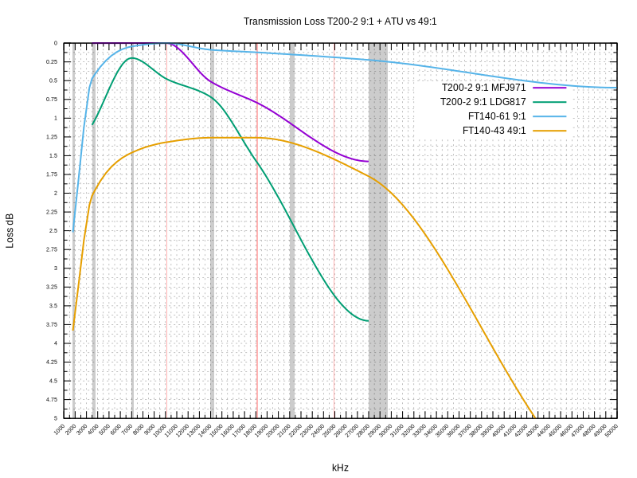

# Efficiency of the T200-2 9:1 transformer

**By [SA6MWA Michel Blomgren](https://youtube.com/c/utesandaren)**  
*sa6mwa@radiohorisont.se*  
*February 2020*  

The abused 9 to 1 transformer feeding a *random* wire antenna...

> [...] These are advertised as 80 through 6m or even 160 through 6m and in my
> opinion are to be avoided. In comparison to the tuned resonant half wave end
> fed the 9:1 types are a few steps above a dummy load. [...] I've had
> countless "antenna interventions" with friends using the 9:1 type end feds,
> wondering why they aren't making any contacts and I'll loan them a resonant
> half wave end fed and its usually a night and day type of improvement.
> [ref](https://forums.radioreference.com/threads/end-fed-antenna.347802/)

I'm not saying the person stating the above did not have this experience, just
that it was not me who put up the 9:1 end fed. Antenna choice, deployment and
design from one ham to another is definitely *night and day*. I can say with
confidence that my deployment of a 9:1 type end fed will _always_ outperform a
resonant half wave end fed. Not to sound too cocky, but yes, it's about knowing
what one is doing, plain and simple - it's not rocket science either. A 49:1
(or 64:1 or whatever) made with an FT-240-43 is always more lossy than a 9:1,
*especially* at 160m, 80m and 6m as the above statement tries to fool you into
thinking. No, the 9:1 even in a system with coax and tuner loss is not *a few
steps above a dummy load*, it's a few step *above* a 49:1 end-fed half wave. As
of recently, I have learned that this is also true for the iron powder T200-2
9:1 transformer - at least up to and including the 20 meter band.

The [EARCHI](http://www.earchi.org/) [9:1
unun](http://www.earchi.org/92011endfedfiles/Endfed6_40.pdf) is a familiar
design made with a T130-2 iron powder toroid. I admit, I have been wrong about
how inefficient the type 2 material is and have been thinking of the 9:1 as a
stable *linear* or ideal *transformer*. Type 2 material and the other iron powder
materials are not meant for making wideband transformers, but for making resonant
circuits. Using them as wideband transformers result in highly different
transformation ratios across the spectrum of interest. This is why measuring a
9:1 transformer made out of e.g FT-140-61 actually can provide a 9 to 1
impedance transformation across the entire HF band and even 6m. Even if the SWR
is not perfect at 6m and 3 MHz, [the loss is perfectly
usable](https://github.com/sa6mwa/miscellaneous/blob/master/articles/backtoback-9to1-and-49to1-measurements/backtoback-9to1-and-49to1-measurements.md),
which is not true for the 49:1 endfed halfwave transformer. Loss at 3.5 MHz is
0.47 dB and 0.59 dB at 6m, compared to 2 dB at 3.5 MHz and 6 dB at 6m with the
49:1. *Choke* on that (pun intended)!

Back to the 9:1 with T200-2 toroid. [This
article](http://vk6ysf.com/unun_9-1.htm) explains a measurement where 2 of
these 9:1 transformers are connected back-to-back. The result is not very
impressive. This is exactly how I measured my ferrite 9:1 transformers (using
FT140-61 and FT240-61). I used to think this was the actual loss, but have now
learned that a 9:1 wound on T200-2 is not a pure transformer, but more of a
resonant circuit with series inductance, capacitance, etc. Connecting two
circuits like this back-to-back results in a very unpredictable *new* circuit
which - depending on frequency - will explain the high losses in a material
usually considered having a high-Q with low loss... but that is only true for
tuned circuits, not as wideband transformers. However, since you would use an
impedance matching unit (an ATU) with the 9:1 transformer, it does not need to
be a nice linear transformer. It just needs to transform enough to give us a
nice low SWR on the coax to prevent mismatch losses before reaching the ATU.

I decided to measure only one of these transformers. Instead of having two - a
step up, and a step down transformer - I used an antenna tuner between the
transceiver and the transformer. The ATU was connected to the high impedance
side of the transformer (the 450 ohm side) while the 50 ohm side of the
transformer was connected to a 50 ohm dummy load. As a bonus, I also measured
tuner efficiency at various complex impedances (as the T200-2 9 to 1
transformation efficiency or linearity varies with frequency). For some of my
measurements, the efficiency was actually better with the transformer than
measuring straight through the ATU to the dummy load. My explanation is that
[an ATU need to face a resistance of more than 50 ohms to have low
loss](https://github.com/sa6mwa/miscellaneous/blob/master/articles/backtoback-9to1-and-49to1-measurements/backtoback-9to1-and-49to1-measurements.md).

Compared to previous results where measurements do not include an ATU, I ran
into the problem that neither the MFJ 971 manual impedance matching device (a
T-match) nor the LDG 817 QRP automatic ATU by LDG managed to tune 160m. Both
where unable to tune the 6 meter band unfortunately, but the T200-2 is probably
not a good design decision for 6m (unlike the #61 material FT140-61 or FT240-61
which work fine for 3 to 50 MHz).

[G3TXQ has an article](http://www.karinya.net/g3txq/unun/) with compatible
result to mine, just using much better equipment. Here, G3TXQ shows that the
T200-2 9 to 1 transformer has really low loss and still provide excellent
impedance transformation to provide a low SWR on the coax.

### The Math

The dB loss was calculated from the power ratio between the reference
measurement (in Watts) and the value with the transformer in line using
10Log10. GNU ``bc`` was used for the calculations with the following
commands...

```console
$ bc -l
ratio=0.9
10*l(ratio)/l(10)
-.4573
```

The following function was defined to simplify the process...

```bc
define log10 (x) { return (10*l(x)/l(10)); }
log10(0.5)
-3.0102

log10(4.25/4.7)
-.4373
```

## Configuration

Below, **Ref50** is the measured reference of an FT-817 connected to a MAAS
power meter in turn connected to a 50 ohm dummy load. The power meter has an
analog gauge and appears not well calibrated. **Ref MFJ951 W** is with an
MFJ-971 manual *antenna tuner* inbetween the transceiver and the power meter. There is some loss here, as is the case with an LDG 817 QRP automatic ATU which is what **Ref LDG817 W** represents.
**9to1 MFJ971 W** is with the T200-2 9:1 unun connected with it's high impedance side to the antenna port of the MFJ 971 ATU and it's 50 ohm impedance side connected into the power meter.
The configuration look like this...

```
Transceiver --> ATU --> Transformer --> Power meter --> 50 ohm dummy load
```

**9:1 MFJ/MFJ dB** is the loss compared to the MFJ971 reference wattage. **9:1
LDG/LDG dB** is the loss compared to the LDG817 reference wattage. Both **9:1
REF/MFJ dB** and **9:1 REF/LDG dB** are comparisons with the **Ref50 W**
respectively. It appears that the MFJ-971 is a slightly better tuner than the
small LDG, but losses are perfectly normal and better or at least at par with
the common 49:1 end-fed half wave transformer. You have some more loss in the
coax with a 9:1 randomwire antenna due to higher SWR, but not very significant
for lengths around 10 meters of RG58, for example. I have all of those numbers
in by previous article mentioned above. And yes, despite what the *bro-science*
on the Internet says, there is very little difference in antenna performance in
a non-resonant antenna wire compared to a resonant one (i.e half wave), as long
as it is long enough for the frequency and you can match it's impedance. Which
you can with a 9:1 unun and a decent impedance matching unit. However, you do
need to use a counterpoise of some sort with a 9:1 randomwire. This will
effectively make the randomwire antenna longer than a comparible end-fed
halfwave, so maybe not really comparable length-to-length. However, the
counterpoise can be the outside of the braid of the coax, which will be true
for the 49:1 end-fed half wave aswell if you want to use it on more than one
band. Both antennas need an RF choke before entering the ATU or transceiver.
The 49:1 is a voltage transformer as is the 9:1, meaning the current will be
unbalanced and will cause RFI in your transceiver if you do not choke it with a
*line isolator* of some kind. Once again, this applies to all voltage
transformers, including the 9:1, 49:1 and the 64:1.

### Loss through ATU and ATU + T200-2 9:1 transformer

| QRG kHz | Ref50 W | Ref MFJ971 W  | MFJ971 loss dB  | Ref LDG817 W  | LDG817 loss dB  | 9to1 MFJ971 W | 9to1 LDG817 W | 9:1 MFJ/MFJ dB  | 9:1 LDG/LDG dB  | 9:1 REF/MFJ dB  | 9:1 REF/LDG dB  |
|--------:|--------:|--------------:|----------------:|--------------:|----------------:|--------------:|--------------:|----------------:|----------------:|----------------:|----------------:|
| 1800    | 3.6     |               |                 | 3.5           |                 |               |               |                 |                 |                 |                 |
| 3500    | 4.7     | 4.0           | 0.7             | 4.5           | 0.19            | 4.25          | 3.5           | 0               | 1.09            | 0.437           | 1.28            |
| 7000    | 5.0     | 4.25          | 0.7             | 4.5           | 0.457           | 4.6           | 4.3           | 0               | 0.198           | 0.362           | 0.655           |
| 10100   | 5.0     | 4.5           | 0.457           | 4.8           | 0.177           | 4.5           | 4.3           | 0               | 0.478           | 0.457           | 0.655           |
| 14000   | 5.0     | 4.5           | 0.457           | 4.6           | 0.362           | 4.0           | 3.9           | 0.512           | 0.717           | 0.969           | 1.079           |
| 18068   | 5.0     | 4.5           | 0.457           | 4.5           | 0.457           | 3.75          | 3.2           | 0.792           | 1.48            | 1.249           | 1.938           |
| 28000   | 5.2     | 4.6           | 0.53            | 3.75          | 1.42            | 3.2           | 1.6           | 1.576           | 3.7             | 2.11            | 5.12            |
| 50000   | 4.6     | 4.5           | 0.096           | 0.25          | 12.65           |               | 0             |                 |                 |                 |                 |



[Gnuplot T200-2 9:1 vs 49:1](tl-t200-2-9to1.gpi)

``73 DE SA6MWA +``
